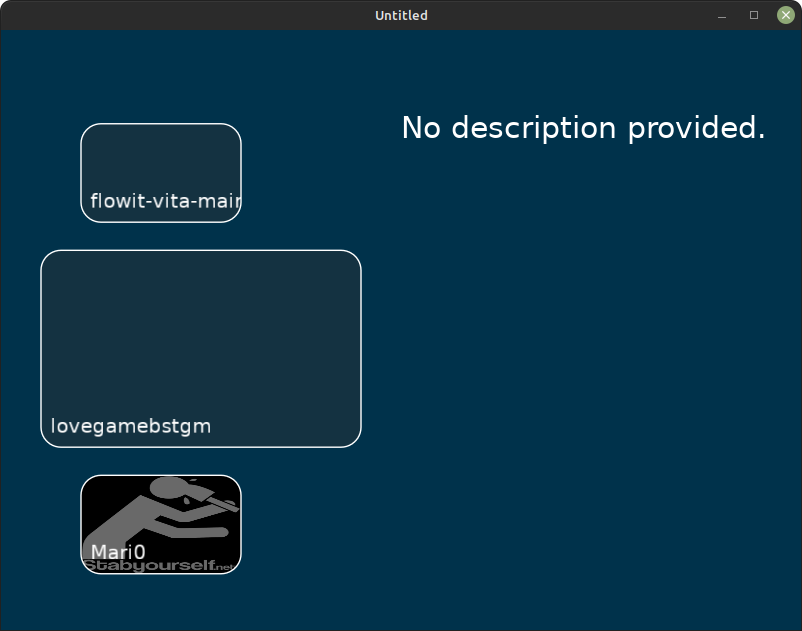

# Love Loader

Custom menu for selecting game from multiple for Love2D.



[Other screenshots](./scr)

# How it works?

Just place games into `games` folder! (like `this_folder/games/game/main.lua`)

Technically, this creates the loop until game wasn't selected or user wants to exit
with custom event handling and redrawing.

# LibLL

Love Loader from 2.0 includes backend API to simplify creating custom skins.

It have not so many functions and fields:

- `ll.games` - field for games, which have this structure:
  ```lua
  {
    name = 'string', -- Friendly name for game or placeholder
    desc = 'string', -- Description for game or placeholder
    base = 'string', -- base directory used in game mounting, must end with `/`
    dir  = 'string', -- directory name, used if no name was defined
    main = 'string', -- main file to execute or `main.lua`
    screens = {'array of', 'path to screenshots'},
    scrcur  = 1, --[[number]] -- current  index from screenshots
    scrprv  = 1, --[[number]] -- previous index from screenshots
    dat = nil, --[[any]] -- maybe platform-dependent data to reduce operations
  }
  ```

- `ll.mdir` - string or nil, contains full mounted directory.

- `ll.mgme` - game or nil, contains mounted game.

- `ll.gameNew(configuration --[[string]], fileName --[[string, not used]], base --[[string]], directory --[[string]])`

  Creates game object (defined above) and returns it.

- `ll.gameAdd(conf, file, base, dir)` - same as `ll.gameNew` with insertion into `ll.games`.

- `ll.addGame(fileName, fileContent)` - function for file dropping, reserved for v3.0.

- `ll.mount(game)` - mounts game.

  Can throw an error.

  Sets `ll.mdir` and `ll.mgme`.

- `ll.umount()` - unmounts game if can.

  Unsets `ll.mdir` and `ll.mgme`.

- `ll.home()` - calls `llHome`

- `ll.dt` - is developer tools enabled?

- `__LL` - global variable of Love Loader instance when developer tools enabled.

- `ll.devtools()` - enable developer tools.

- `ll.fsIsAbs(file)` - is file absolute (/file)?

- `ll.fsIsRel(file)` - is file relative, inverted result of ll.fsIsAbs (./file).

- `ll.fsDir(path)` - get directory name (2 from /1/2/3.file).

- `ll.fsFile(path)` - get file (including dividers after) (2 from /1/2/).

- `ll.kbInit(direction --[[string: *, h, v, x, y]], c1 --[[number, coordinate before card for mouse (left/top)]], c2 --[[number, coordinate after card for mouse (right/bottom)]], clim --[[other coordinate limit for mouse or -1 to disable]])` - initialize keyboard module for skins.

- `ll.kbGet() --[[nil, string: <, >, o, m, ^ anv v if direction is *]]` - get key pressed.

# API

To reduce things to do for game developers, this loader creates some global variables to use.

You can also use it without Love Loader (or if your game can distribute without loader) by including `ll-min.lua` file.

`W` and `H`: width and height of the screen which controls by custom love.resize function.

`love.resize` and optional `resize` payload: functions called when screen size was changed and on booting.

`love.event.quit`: function to exit to main screen.

`llHome`: function called by `love.event.quit` (broken for now).

`llUsed`: is Love Loader (not minimal API) used.

`COLDIV`: color divider (1 or 255) to `love.graphics.setColor` function.

`MOBILE`: is this device runs Android or iOS?

# Fill game information

To fill game information in game folder need to create `info.ll` file.

Syntax is `k = v` with `# comments`

```
# are there needed any comments?
name = New awesome game using Love Loader
desc = Some descripion about the game.
# main = optional main file instead of `main.lua`
pic = screen.png
pics = [ screen.png; screen2.png ] # wow arrays
```

